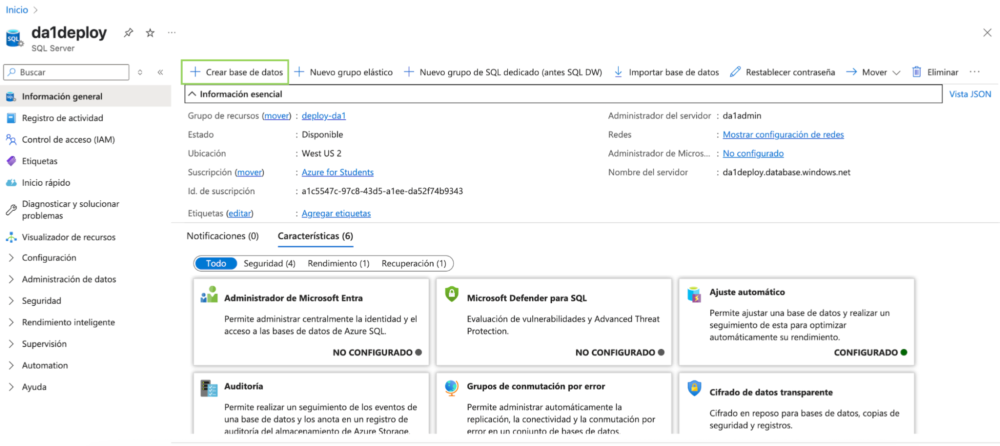

# Guía de despliegue de DA1

## Introducción:

(Cloud Computing)[https://cloud.google.com/learn/what-is-cloud-computing?hl=es], o computación en la nube, es un modelo de entrega de servicios de computación (como servidores, almacenamiento, bases de datos, redes, software, etc.) a través de Internet. En lugar de instalar y mantener estos servicios en una computadora personal o servidor físico, se accede a ellos cuando se necesitan.

### Beneficios de usar la nube

- Accesible desde cualquier lugar: solo necesitas Internet para acceder a tus servicios.
- Modelo de pago por uso: no es necesario comprar servidores físicos costosos. Solo se pagan los recursos utilizados.
- Escalabilidad y flexibilidad: podés aumentar o disminuir los recursos según la demanda (por ejemplo, más capacidad cuando tu app tiene muchos usuarios).
- Seguridad y respaldo: los proveedores ofrecen mecanismos de seguridad integrados, copias de seguridad automáticas y recuperación ante desastres.
- Despliegue rápido: se puede tener una base de datos o una app corriendo en cuestión de minutos.

### Requisitos previos:

1. Contar con una cuenta de [Azure For Students](https://azure.microsoft.com/es-es/get-started/azure-portal/). La facultad cuenta con un convenio que otorga 100 dólares anuales en créditos de Azure. Se puede activar a través del siguiente enlace:
   <https://azure.microsoft.com/es-es/free/students>

   **Es importante que el registro se realice con el mail de Microsoft de la facultad (fi365)**. 

   **IMPORTANTE: Al ser créditos limitados, es necesario que se eliminen todos los recursos cuando ya no vayan a ser utilizados. Sobre el final de esta guía se especifica cómo se puede realizar.**

2. Contar con Docker instalado.


## Creación del servidor SQL (SQL Server):

1. Ingresar a Azure Portal: <https://portal.azure.com/>. Es importante haber habilitado la suscripción **Azure For Students**.
2. Seleccionar “Crear un recurso” para proceder con la creación del **Servidor de SQL**, en donde se encontrará la base de datos a crear:


   
Una vez seleccionada esa opción, buscamos SQL Server y seleccionamos la opción de **SQL server (logical server)**:


3. Se procederá con la configuración del servidor. Para ello se selecciona en **Suscripción** “Azure for Students” y en **Grupo de recursos** seleccionamos crear uno nuevo y le asignamos un nombre a elección. 

Un recurso de Azure es cualquier servicio que puedas crear o usar dentro de la plataforma Azure, como una máquina virtual, una base de datos o una cuenta de almacenamiento.

Un grupo de recursos es un contenedor lógico que agrupa varios recursos relacionados para facilitar su administración, monitoreo y control de acceso. Todos los recursos dentro de un grupo comparten el mismo ciclo de vida.


En “Detalles del servidor”, le asignamos un nombre a nuestro servidor y en **región seleccionamos West US 2.**


Como método de autenticación seleccionamos **Uso de la autenticación de SQL**. **Es importante recordar el usuario y la contraseña** (ya que las necesitaremos luego. Se sugiere utilizar una contraseña segura para evitar posibles ataques).

 

4. En la sección de Redes, **habilitar las Reglas de firewall**:


   
**Este paso es fundamental para que el servidor de SQL pueda interactuar con la aplicación.**

4. Verificar la configuración previa a crear el recurso:


1. Seleccionar **Crear** y esperar a que se cree el recurso. Esto puede tomar unos minutos.


**Creación de la base de datos SQL:**

1\. En la home de Azure Portal (https://portal.azure.com/#home), seleccionamos el recurso de SQL Server recién creado. Seleccionamos la opción de Crear base de datos.



2\. Configurar la base de datos. Seleccionar Apply Offer para que la base de datos sea gratuita:


Acá es importante considerar que este plan gratuito presenta limitaciones. El plan incluye 100.000 *vCore-seconds* por mes, lo que equivale al uso de 1 núcleo virtual de CPU durante 27,7 horas (de tiempo de uso, no tiempo real). Esta cuota **solo se consume cuando hay actividad en la base de datos** (consultas, escritura, procesamiento). Si no se usa, **no se gasta**. Es clave monitorear el uso y optimizar las consultas, ya que al superar el límite pueden aplicarse cargos adicionales o limitarse el servicio.

**Alternativamente, si no se puede acceder al plan gratuito, puede utilizarse esta configuración que no presenta estas limitaciones, pero va a consumir 4 créditos al mes (de los incluidos en el plan de Azure):**


Es **importante** seleccionar como entorno de carga de trabajo la opción de **Implementación** para evitar gastos elevados. Si se seleccionó este plan, validar en esa misma pantalla que los costos sean similares a los siguientes previo a la creación de la base de datos (recordar que son los créditos que se descontarán a los 100 incluidos en el plan de estudiantes):


4\. Una vez configurada la base de datos, seleccionar **Revisar y crear,** y proceder con la creación del recurso. Esto puede tomar unos minutos.

**Consideraciones**

5\. Desde Azure Portal ingresar al recurso de la base de datos recién creada. 

1. El **Connection String** se puede obtener en la sección de **Configuración -> Cadenas de conexión**. El string a utilizar es el correspondiente a la autenticación de SQL. **Es importante modificar el atributo de Password con la contraseña que se ingresó al momento de crear el SQL Server.


**Importante:** Si se desea utilizar esta base de datos desde el proyecto se deberá modificar el archivo appsettings.json. Esto es optativo y nos permitirá acceder a la base de datos recién creada (que se encuentra en la nube), incluso cuando se levanta la aplicación de forma local (sin despliegue).

1. Se pueden **ejecutar scripts de SQL en la sección de Editor de Consultas**:


Previamente nos va a requerir autenticación para realizar las consultas. Las credenciales a utilizar son las mismas creadas para la autenticación al momento de crear el SQL Server.

**IMPORTANTE: Una vez que no se vaya a utilizar más este recurso, eliminar el SQL Server y la Base de Datos para evitar gastos innecesarios de los créditos de Azure**


## Uso y modificación del DockerFile

1. Agregar en el proyecto del obligatorio, un archivo dockerfile en el root del proyecto:

El dockerfile deberá seguir la esta estructura:
```docker
FROM mcr.microsoft.com/dotnet/aspnet:8.0 AS base
WORKDIR /app
EXPOSE 80
EXPOSE 443

ENV ASPNETCORE\_ENVIRONMENT=Development

# Etapa de build
FROM mcr.microsoft.com/dotnet/sdk:8.0 AS build
WORKDIR /src

# Copiar los proyectos
COPY ./Domain/Domain.csproj Domain/
COPY ./FileReaders/FileReaders.csproj FileReaders/
COPY ./UserInterface/UserInterface.csproj UserInterface/
COPY ./BusinessLogic/BusinessLogic.csproj BusinessLogic/
COPY ./Repository/Repository.csproj Repository/
COPY ./IRepository/IRepository.csproj IRepository/
COPY ./IBusinessLogicImport/IBusinessLogicImport.csproj IBusinessLogicImport/

# Restaurar paquetes
RUN dotnet restore UserInterface/UserInterface.csproj

# Copiar el resto de los archivos
COPY ./Domain/ Domain/
COPY ./UserInterface/ UserInterface/
COPY ./BusinessLogic/ BusinessLogic/
COPY ./Repository/ Repository/
COPY ./FileReaders/ FileReaders/
COPY ./IRepository/ IRepository/
COPY ./IBusinessLogicImport/ IBusinessLogicImport/

WORKDIR /src/UserInterface
RUN dotnet build -c Release -o /app/build

FROM build AS publish
WORKDIR /src/UserInterface
RUN dotnet publish UserInterface.csproj -c Release -o /app/publish

# Imagen final
FROM base AS final
WORKDIR /app
COPY --from=publish /app/publish .
ENTRYPOINT ["dotnet", "UserInterface.dll"]
```

2. Modificar el dockerfile de modo que, cuando se realice la **copia de los proyectos**, los archivos y los directorios se correspondan con los del proyecto. Esto depende de la estructura elegida. Como modo de ejemplo, este dockerfile corresponde a la siguiente estructura de carpetas:


La misma consideración se deberá tener cuando se hace la copia del resto de archivos. Además, se deberá sustituir las apariciones de UserInterface por el nombre del proyecto que contenga el punto de entrada a la solución (en otras palabras, el proyecto que contiene el archivo [Program.cs](http://program.cs)).

## Instalación del Azure CLI y despliegue:

Se deberá instalar el Azure CLI:

Para Windows:
<https://learn.microsoft.com/es-es/cli/azure/install-azure-cli-windows?view=azure-cli-latest&pivots=zip>

Para Mac:
<https://learn.microsoft.com/en-us/cli/azure/install-azure-cli-macos?view=azure-cli-latest>

**Despliegue del proyecto:**
Una vez instalado el Azure CLI, nos encontramos en condiciones de realizar el despliegue. **Para este paso es fundamental tener Docker abierto.**

1\. Desde la terminal, iniciar sesión en Azure:

`az login` 

Una vez realizado el login, se mostrará una lista con la lista de suscripciones que la cuenta tiene activa. Se debe seleccionar la suscripción estudiantil.

2\. Una vez iniciada la sesión, habilitar los permisos para poder ejecutar el script deploy.sh, el cual fue brindado previamente y se debe encontrar en el root del proyecto:
chmod +x deploy.sh   

3\. Ejecutar el script: 
deploy.sh

**Se pedirán ciertos valores al momento de ejecutar el script. Es fundamental que se proveé el valor correctos de los mismos:**

**APP\_NAME**: Un identificador para nuestra aplicación. Se puede setear el valor que se deseé.

**RESOURCE\_GROUP**: El nombre del resource group que fue creado al momento de la creación del SQL Server

**SQL\_SERVER\_NAME**: El nombre del SQL Server que fue creado al inicio de la guía.

**SQL\_DB\_NAME**: El nombre de la base de datos que fue creada al inicio de la guía.

**SQL\_ADMIN\_USER**: El nombre del usuario de SQL que fue configurado para el SQL Server al momento de su creación.

**SQL\_ADMIN\_PASS:** La contraseña que fue seteada para el usuario de autenticación SQL, seteada al momento de la creación del SQL Server.

En el ejemplo se utilizaron estos valores:

APP\_NAME=deploy-da1 

RESOURCE\_GROUP=deploy-da1 

SQL\_SERVER\_NAME=da1deploy 

SQL\_DB\_NAME=da1-bd

SQL\_ADMIN\_USER=da1admin


Una vez ejecutado, en la terminal se podrá ver el estado del despliegue y la url donde se encontrará nuestro proyecto:


También se puede consultar la URL con el siguiente comando:
```
az containerapp show --name $APP\_NAME --resource-group $RESOURCE\_GROUP --query properties.configuration.ingress.fqdn -o tsv  
```

### En caso de que se realicen cambios en el código y se deseé volver a deployar, será necesario ejecutar el comando `az login` e iniciar sesión y luego el script `./deploy.sh --redeploy`

(Importante incluir la flag de **–redeploy** para no generar recursos repetidos)

# Importante: Pausar y eliminar recursos

Como los créditos son limitados, es **fundamental** pausar los recursos mientras no se haga uso de ellos. Para esto, se deberá ingresar al Portal de Azure, ir hacia el grupo de recursos creados y seleccionar la aplicación contenedora:

Ver si hay algun script para bajar/subir


Una vez en el recurso, se deberá seleccionar detener (o iniciar, en el caso de que se le quiera dar uso):

 

Detener e iniciar la aplicación contenedora al momento de usarla es fundamental para no gastar los 100 créditos de Azure y poder utilizarlos para otras asignaturas o proyectos.

Una vez que no se deseé hacer más uso de los recursos (por ejemplo al finalizar el semestre, luego de la defensa), se podrá eliminar el resource group para evitar posibles gastos de créditos:


