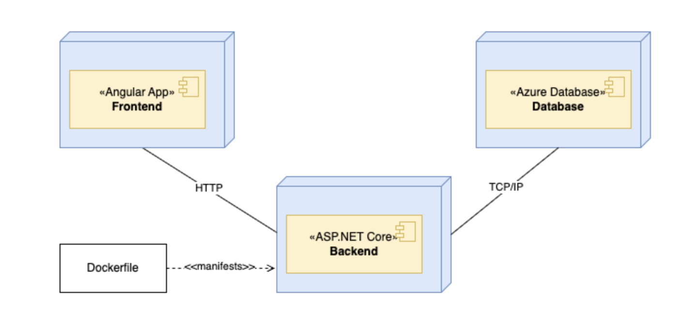

# Despliegue DA2 

Para desplegar el proyecto de Diseño de Aplicaciones 2, se deberán implementar los siguientes componentes de forma separada:

**Frontend:** será desplegado en Vercel, lo que permite una integración sencilla con repositorios de Git y facilita el despliegue continuo de aplicaciones web.

**Backend:** se desplegará en Render, plataforma que permite ejecutar servicios de API con soporte para aplicaciones en diferentes lenguajes y entornos. Para ello necesitaremos un Dockerfile configurado correctamente, que defina el entorno de ejecución y las instrucciones necesarias para compilar y ejecutar el proyecto. Esto permite garantizar que la aplicación se ejecutará de forma consistente tanto en Render como en entornos locales o de prueba.

**Base de datos:** el sistema utiliza Azure SQL Database, un servicio de base de datos en la nube proporcionado por Microsoft Azure. 

Acceso a guías:
- [Backend y Base de datos](./guia_despliegue_backend_da2.md)
- [Frontend](./guia_despliegue_frontend_da2.md)

## Consideraciones de disponibilidad

Si bien tanto Render como Azure SQL Database ofrecen altos niveles de disponibilidad con garantías mediante acuerdos de nivel de servicio (SLA), es importante comprender que ningún servicio en la nube garantiza un 100% de disponibilidad real. Eventualmente pueden producirse caídas, interrupciones o mantenimientos programados.

Por este motivo, es recomendable contar con mecanismos alternativos o planes de contingencia, como la posibilidad de levantar el backend localmente o realizar respaldos periódicos de la base de datos. Esto permite continuar con el desarrollo o acceder a la información crítica del sistema ante eventuales fallas en los servicios en la nube.