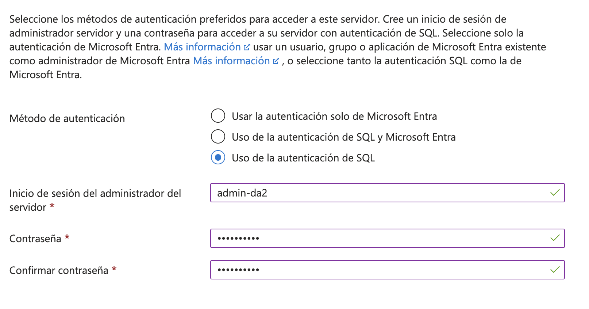
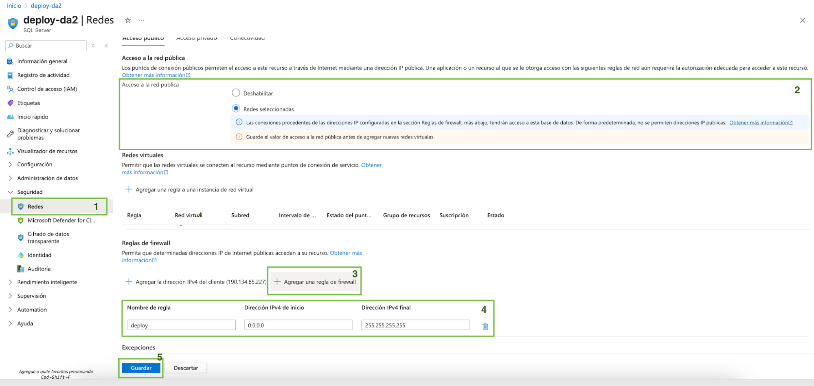
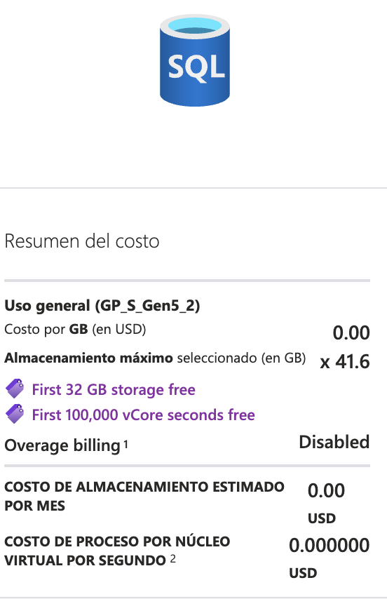

# Guía de despliegue de Backend

## Creación del servidor SQL (SQL Server):

1. Contar con una cuenta de Azure For Students. La facultad cuenta con un convenio que otorga 100 dólares anuales en créditos de Azure. Se puede activar a través del siguiente enlace:  

   [https://azure.microsoft.com/es-es/free/students](https://azure.microsoft.com/es-es/free/students)

   **Es importante que el registro se realice con el mail de Microsoft de la facultad** (fi365). 

   **IMPORTANTE: Al ser créditos limitados, es necesario que se eliminen todos los recursos cuando ya no vayan a ser utilizados.**

2. Una vez habilitado este beneficio, ingresar a Azure Portal:  
   [https://portal.azure.com/](https://portal.azure.com/)

3. Seleccionar “Crear un recurso” para proceder con la creación del **Servidor de SQL**, en donde se encontrará la base de datos a crear:  


   
Una vez seleccionada esa opción, buscamos SQL Server y seleccionamos la opción de **SQL server (logical server)**.  


4. Se procederá con la configuración del servidor. Para ello se selecciona en **Suscripción** “Azure for Students” y en **Grupo de recursos** seleccionamos crear uno nuevo y le asignamos un nombre a elección.

 
     
En “Detalles del servidor”, le asignamos un nombre a nuestro servidor y en **región seleccionamos West US 2**

  
     
Como método de autenticación seleccionamos **Uso de la autenticación de SQL**. **Es importante recordar el usuario y la contraseña** (ya que las necesitaremos para el connection string) 


  
5. Verificar la configuración previa a crear el recurso:


6. Seleccionar **Crear** y esperar a que se cree el recurso. Esto puede tomar unos minutos.

7. **Configuramos el SQL Server.** Para ello elegimos el recurso creado desde el inicio de Azure Portal ([https://portal.azure.com/](https://portal.azure.com/)). Ingresamos a la sección de **Seguridad \-\> Redes**. Seleccionamos la opción de redes seleccionadas y agregamos una nueva **regla de Firewall** que nos permita acceder desde una ip determinada. En este ejemplo se creó la regla de “deploy” y el rango de IPs seleccionado fue 0.0.0.0 a 255.255.255.255. Si ya se sabe que IPs van a utilizar la base de datos, lo ideal es reducir a ese rango a esas IPs. No obstante, si ya se conocen las direcciones IP desde las cuales se va a acceder a la base de datos, lo recomendable es restringir el rango únicamente a esas direcciones específicas. Esta práctica responde a criterios fundamentales de seguridad, ya que limitar el acceso exclusivamente a orígenes confiables reduce significativamente la superficie de ataque y minimiza los riesgos asociados a accesos no autorizados. Resulta especialmente importante aplicar esta medida en entornos productivos, donde la protección de los datos y la estabilidad del sistema constituyen una prioridad.

**Este paso es importante para que se pueda hacer uso de la base de datos de forma externa a Azure.** El flujo de creación de la regla se puede visualizar en la siguiente imagen:  
     


## Creación de la base de datos SQL:

1\. En la home de Azure Portal (https://portal.azure.com/#home), seleccionamos el recurso de SQL Server recién creado. Seleccionamos la opción de Crear base de datos.


2\. Configurar la base de datos. Seleccionar Apply Offer para que la base de datos sea gratuita:


Acá es importante considerar que este plan gratuito presenta limitaciones. El plan incluye 100.000 *vCore-seconds* por mes, lo que equivale al uso de 1 núcleo virtual de CPU durante 27,7 horas (de tiempo de uso, no tiempo real). Esta cuota **solo se consume cuando hay actividad en la base de datos** (consultas, escritura, procesamiento). Si no se usa, **no se gasta**. Es clave monitorear el uso y optimizar las consultas, ya que al superar el límite pueden aplicarse cargos adicionales o limitarse el servicio.

Si se eligió esta opción, verificar en el panel de la derecha que la base de datos que se está creando es gratuita:



**Alternativamente, si no se puede acceder al plan gratuito, puede utilizarse esta configuración que no presenta estas limitaciones, pero va a consumir 4 créditos al mes (de los incluidos en el plan de Azure):**

Para ello, se configurará la base de datos de la siguiente manera: Completar los siguientes campos con la siguiente información:

**Suscripción:** Azure for students.  
**Grupo de recursos:** se selecciona el que fue creado junto con el SQL Server.  
**Nombre de la base de datos:** El nombre que se le deseé asignar a la base de datos  
**Servidor:** Se selecciona el SQL Server creado previamente.  
**Quiere usar un grupo elástico de SQL:** No 
**Entorno de carga de trabajo:** Implementación  
**Redundancia de almacenamiento de copia de seguridad:** Redundancia local

**Estos tres últimos puntos son fundamentales, ya que es la forma de reducir costos y no exceder los créditos brindados por Azure.** 


3\. Una vez configurada, seleccionar **Revisar y crear,** y proceder con la creación del recurso. Esto puede tomar unos minutos.

4\. Desde Azure Portal ingresar al recurso de la base de datos recién creada, donde:

1. El **Connection String** se puede obtener en la sección de **Configuración \-\> Cadenas de conexión**. El string a utilizar es el correspondiente a la autenticación de SQL. **Es importante modificar el atributo de Password con la contraseña que se ingresó al momento de crear el SQL Server.**


**Importante:** Si se desea utilizar esta base de datos desde el proyecto se deberá modificar el archivo appsettings.json. Esto es optativo y nos permitirá acceder a la base de datos recién creada (que se encuentra en la nube), incluso cuando se levanta la aplicación de forma local (sin despliegue).

2. Se pueden **ejecutar scripts de SQL en la sección de Editor de Consultas:**  

 
     
Previamente nos va a requerir autenticación para realizar las consultas. Las credenciales a utilizar son las mismas creadas para la autenticación al momento de crear el SQL Server.  

**IMPORTANTE: Una vez que no se vaya a utilizar más este recurso, eliminar el SQL Server y la Base de Datos para evitar gastos innecesarios de los créditos de Azure**

## Despliegue en Render:

1. Agregar el siguiente DockerFile en el root del proyecto de Backend (en el mismo nivel que donde se encuentra el archivo .sln). Además, se deberán hacer algunas modificaciones.

```Docker
ARG PROJECT_NAME=PharmaGo.WebApi

FROM mcr.microsoft.com/dotnet/sdk:8.0 AS build
WORKDIR /src

# Copiar todos los .csproj y restaurar dependencias
COPY ./*.sln ./
COPY . ./
RUN dotnet restore

RUN dotnet publish "${PROJECT_NAME}/${PROJECT_NAME}.csproj" -c Release -o /app/publish

FROM mcr.microsoft.com/dotnet/aspnet:8.0 AS final
WORKDIR /app
COPY --from=build /app/publish .

EXPOSE 80
ENV ASPNETCORE_URLS=http://+:80
ENV ASPNETCORE_ENVIRONMENT=Development

ENTRYPOINT ["dotnet", "${PROJECT_NAME}.dll"]
  
```   

Se deberá modificar la variable Project Name (Se deberá sustituir PharmaGo.WebApi por el nombre del proyecto en el cuál tenemos nuestro punto de entrada a nuestra solución, es decir, el Program.cs).

2\. En el [program.cs](http://program.cs), previo a la línea de código de app.Run(), ingresar la siguiente lógica para realizar las migraciones una vez levantada la aplicación. Esto será fundamental para que la estructura de base de datos sea creada en la base de datos de Azure. **Es importante modificar el siguiente segmento de código para que se haga una referencia a la clase en la cuál se definió el DbContext.** Por ejemplo, en este proyecto se utilizó PharmaGo.DataAccess.PharmacyGoDbContext:

```C#
using (var scope \= app.Services.CreateScope())  
{  
   var db \= scope.ServiceProvider.GetRequiredService\<PharmaGo.DataAccess.PharmacyGoDbContext\>();  
   db.Database.Migrate();   
}

app.Run();
```

3\. Ingresar a la web de [Render](https://render.com/%20)

4\. Crear una cuenta en caso de no contar con una. Seleccionar la opción gratuita. **No es necesario seleccionar alguna opción de pago.**   

5\. Una vez creada la cuenta, navegar al dashboard: [https://dashboard.render.com/](https://dashboard.render.com/)   

6\. Seleccionar Add new y la opción de **Web Service!**


7\. Permitir el acceso a Git y al repositorio correspondiente. Seleccionar la opción de Git Provider en Source Code. Seleccionar el repositorio en el cuál se encuentre el código a deployar.


   
8\. Configurar el web service a deployar. Modificar los siguientes campos:  

**Language:** Docker  

**Branch:** Main (La rama sobre la cuál queremos que se realice el deploy. Asumiendo que queremos deployar el ambiente de producción, seleccionamos Main). Es importante mencionar que cada vez que se realice un push sobre la rama seleccionada, se ejecutará de forma automática el proceso para realizar el despliegue con los nuevos cambios. 

**Root Directory:** Colocar el path hacia el root de nuestro proyecto de .NET. En este caso en donde se encontrará nuestro Dockerfile.


En Instance Type, **seleccionar el plan gratuito:**


En Environment Variables, se setea el **Connection String** (obtenido previamente en el paso de la creación de la base de datos). 

Es importante que el nombre de la variable de entorno siga este formato:   
**`ConnectionStrings__<NombreLógico>`**  
donde `<NombreLógico>` es el nombre definido en el archivo `appsettings.json` bajo la sección `ConnectionStrings`.

Por ejemplo, en el appSettings.json del proyecto utilizado para la elaboración de esta guía, se encuentra la siguiente configuración para el connection string:  


Acá se puede ver que el nombre lógico es PharmaGo, por lo cual en la configuración de Render, el nombre de la variable de entorno para el Connection String es el siguiente:


Una vez realizada la configuración, seleccionar Deploy Web Service. Esperar a que se realice. Si transcurrió con éxito, se puede acceder a la pestaña de events, en la cuál nos indicará los estados de los últimos deploys realizados y se nos proveerá la Base URL sobre la cuál estarán deployados nuestros servicios:


Utilizar esa URL como base url. Siguiendo el ejemplo de esta guía, si la url del endpoint para el inicio de sesión es /api/login, se tendrá que consultar https://pharmago-api.onrender.com/api/login

**NOTA: Al ser un servicio gratuito y limitado, el tiempo de respuesta puede llegar a ser más bajo si se ejecutan múltiples requests al mismo tiempo. Puede suceder que sea necesario ingresar a la url (por ejemplo** [https://pharmago-api.onrender.com/](https://pharmago-api.onrender.com/)**) para activar el servicio si no fue utilizado por un periodo de tiempo.**