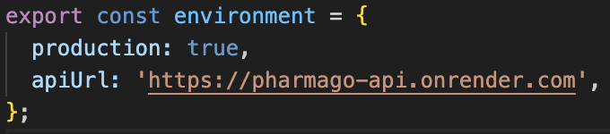
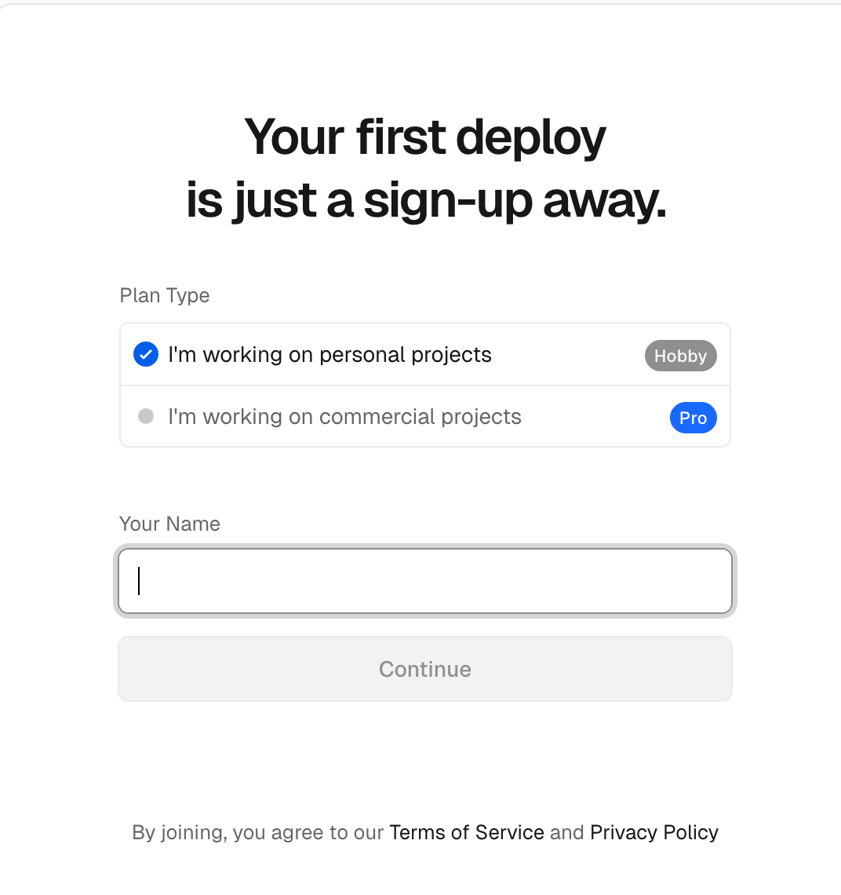
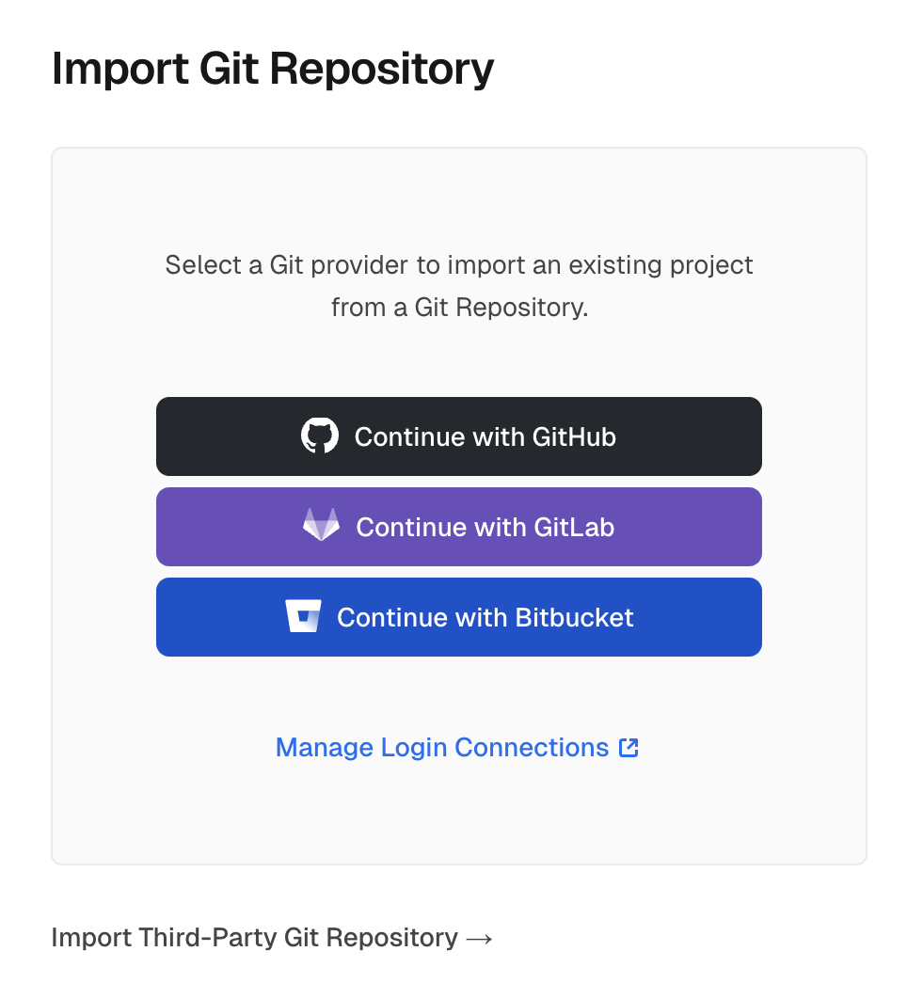
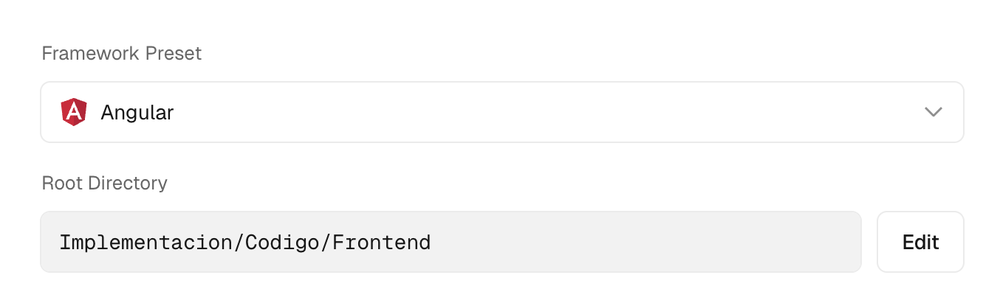
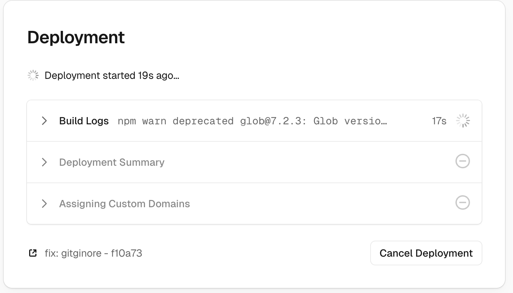
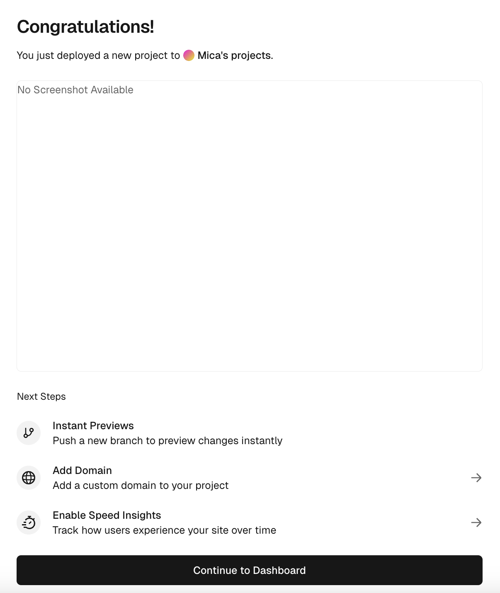
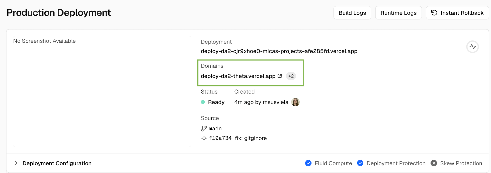

# Despliegue del componente de Frontend

Para el correcto funcionamiento de esta guía, es necesario haber realizado previamente el deploy del componente de [Backend](./guia_despliegue_backend_da2.md).

## Conexión con el Backend:

1. Modificar la **Base Url en el proyecto de Angular** con la del backend deployado en el archivo **environment.prod.ts.** Por ejemplo, si mi url resultante del deploy del backend es: https://pharmago-api1.onrender.com, el archivo **environment.prod.ts** debería quedar así:  
   

En caso de no contar con variables de entorno, se puede modificar el base url que se esté utilizando. 

Para leer más sobre variables de entorno en Angular y cómo definirlas, se puede consultar la [documentación oficial](https://v17.angular.io/guide/build).

## Despliegue en Vercel:

1. Ingresar a la web de [Vercel](https://vercel.com/), servicio por el cuál realizaremos el deploy de nuestra aplicación. 

2. Crear una cuenta en caso de no contar con una. Seleccionar **Hobby** como plan type.

3. Seleccionar Import Git Repository y conectar con la cuenta donde se encuentra el proyecto a deployar. Si no se utilizó el servicio antes, es necesario darle acceso a Vercel a nuestros repositorios de GitHub (se puede optar por darle acceso a todos los proyectos o solo al que se desee desplegar).  

4. Una vez conectado, nos aparecerán los proyectos que tenemos en nuestro repositorio. También nos ofrece la opción de importar proyectos de terceros. Seleccionamos el repositorio a deployar. 

5. Al momento de configurar un nuevo proyecto, nos aseguramos que el **Framework Preset** seleccionado sea **Angular** y el **Root Directory** sea la ruta en la que se encuentra el **root de nuestro proyecto de Angular** (en donde se encuentran los archivos package.json y tsconfig.json). En los demás campos se dejan los valores **por defecto**. En **Project Name** se agrega el nombre del proyecto a deployar.

6. Una vez configurado, clickear sobre el botón para deployar. Una vez seleccionado, se mostrará el estado de deploy por debajo del formulario. 

7. Una vez realizado el deploy, se mostrará una pantalla en la cuál se notificará el estado final del mismo. Seleccionamos el botón de “Continue to Dashboard”  

  
     
8. Una vez en el dashboard, aparecerá una card que indicará información sobre el último deploy. En el campo Domain se mostrará la URL por la cuál será posible ingresar al Frontend deployado.   

9. Es importante mencionar que Vercel por defecto tiene configurada la opción de **Despliegue Continuo**, esto quiere decir que siempre que se haga un push a Main, se realizará un despliegue de forma automática en Vercel, permitiendo ver en segundos los cambios realizados en Main.  
   
