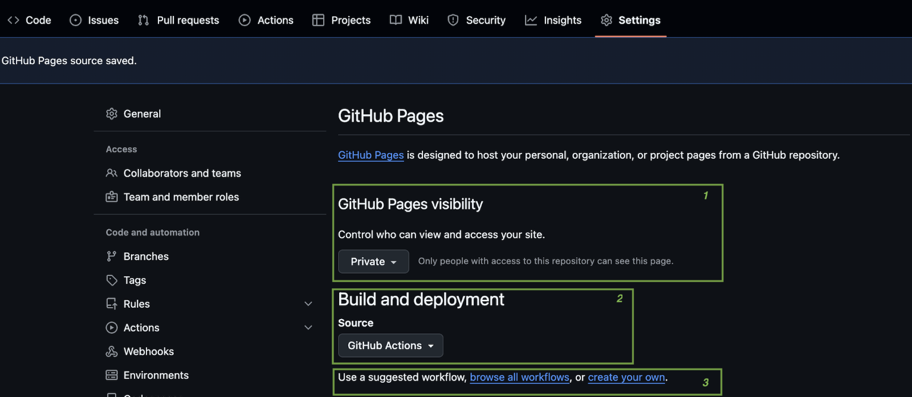
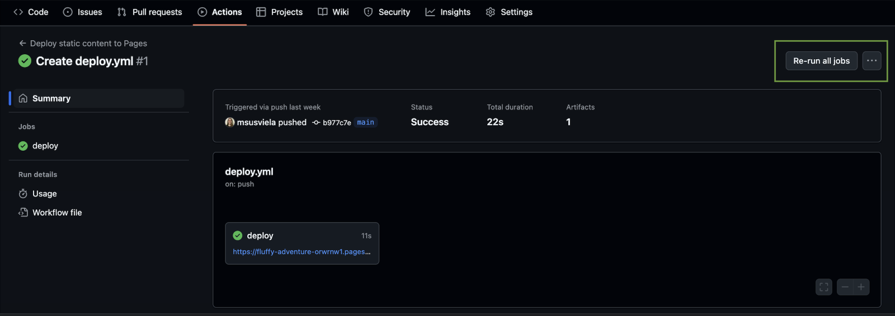

# Guía de despliegue con GitHub Pages

El despliegue de aplicaciones y sitios web en la nube es una práctica fundamental en el desarrollo de software. En entornos educativos, utilizar GitHub Pages permite a docentes y estudiantes publicar proyectos de manera sencilla, asegurando accesibilidad, mantenibilidad y control de versiones.

[GitHub Pages](https://docs.github.com/es/pages) es un servicio de hosting basado en la nube que permite publicar sitios web estáticos directamente desde un repositorio de GitHub. Esto aprovecha los beneficios de cloud computing, como:

- **Accesibilidad Global**: Los sitios están disponibles desde cualquier ubicación con acceso a Internet.
- **Escalabilidad y Fiabilidad**: GitHub maneja la infraestructura sin necesidad de configuraciones adicionales.
- **Control de Versiones**: Al estar integrado con Git, permite rastrear cambios y colaborar de manera eficiente.

## Requisitos

- Un repositorio creado en la organización del dictado.
- Un proyecto creado en ese repositorio que cuente con un archivo `index.html`.

## Motivación

- Presentar la **disponibilidad** como atributo de calidad.
- Ilustrar de forma clara las **estrategias de branching** (por ejemplo, al desplegar el código en `main`, los alumnos podrán entender mejor la diferencia entre `main` y `develop`).
- Introducción al concepto de **deploy** y su vínculo con el proceso de desarrollo de software, en particular con la etapa de **mantenimiento**.
- Facilita una **nueva etapa de validación** con interesados.
- Testing en un **ambiente independiente** a la configuración local del alumno.
- Posibilidad de que el estudiante pueda **mostrar el trabajo realizado** a lo largo del semestre.
- Oportunidad para que los alumnos desplieguen **código estático** y generen un **portfolio**.

## Pasos

1. **Crear un repositorio** con el código fuente del proyecto. Asegurarse de que incluya un archivo `index.html`.
2. **Ir a la sección de _Settings_ del repositorio**. En la sección de _Pages_:
   - Cambiar la **visibilidad a público** para que el contenido sea accesible.
   - En la opción de **Build and deployment**, seleccionar **GitHub Actions** como _source_.
   - Seleccionar la opción _create your own_.
   
3. **Sustituir el bloque de código por defecto** por el siguiente y nombrar el archivo como `deploy.yml` (**es importante incluir la extensión `.yml`**):

```yaml
name: Deploy static content to Pages

on:
  # Se ejecuta al hacer push a la rama predeterminada (main)
  push:
    branches: ["main"]

  # Permite ejecutar el flujo de trabajo manualmente desde la pestaña de Actions
  workflow_dispatch:

# Configura los permisos del GITHUB_TOKEN para permitir el despliegue a GitHub Pages
permissions:
  contents: read
  pages: write
  id-token: write

concurrency:
  group: "pages"
  cancel-in-progress: false

jobs:
  deploy:
    environment:
      name: github-pages
      url: ${{ steps.deployment.outputs.page_url }}
    runs-on: ubuntu-latest
    steps:
      - name: Checkout
        uses: actions/checkout@v4  
      - name: Setup Pages
        uses: actions/configure-pages@v5   
      - name: Upload artifact
        uses: actions/upload-pages-artifact@v3 
        with:
          # Path
          path: './src'  
      - name: Deploy to GitHub Pages
        id: deployment
        uses: actions/deploy-pages@v4
```

> **Aclaración: Es importante destacar que si se tiene la lógica de la interfaz y del dominio en un path diferente al brindado por el
> template del obligatorio (/src) se deberá cambiar en el código brindado el path en donde está indicado.**
>
> En la sección de branches se indica la rama sobre la cual se realizará
> el deploy (se mostrará el contenido que corresponda al código que se
> encuentre en esa rama). En este caso, se hará sobre la rama de **main,
> es decir, lo que se mostrará en el navegador una vez terminado el
> proceso corresponde al código en main.**
> 


En la sección de branches se indica la rama sobre la cual se realizará el deploy (se mostrará el contenido que corresponda al código que se encuentre en esa rama). En este caso, se hará sobre la rama de main, es decir, lo que se mostrará en el navegador una vez terminado el proceso corresponde al código en main. 


4.  Seleccionar **Commit Changes** para guardar el workflow. Si se hace sobre main recordar traerse ese cambio a las ramas donde sea necesario.

5.  Esperar a que se realice el deploy. Esto puede llevar algunos minutos.

Se puede ver el estado del deploy en el menú que aparece a la derecha de la sección **Code** (ver nota al pie del documento si este paso falla):

 

> **Es importante considerar que muchas veces puede aparecer cómo realizado pero que puede tardar unos minutos en mostrar el contenido en la url.**

6.  Ingresar a la pestaña de Settings del repositorio. En la sección de Pages se podrá ver la URL donde la aplicación se encuentra
    hosteada.

    

7.  Acceder a la url, sumándole el path interfaces/index.html al final.
    En este ejemplo se deberá acceder a <https://ingsoft-fis-2025-1.github.io/prueba-deploy-pages-equipo1/interface/index.html>

## Fallas frecuentes

En caso de que falle se puede ir a la sección de Actions, seleccionar el workflow que falló:


Seleccionar Re-run all jobs:



Si sigue fallando verificar que el bloque de código se copió correctamente (la identación es importante en los archivos de tipo
.yml), que la extensión del archivo creado sea .yml y si el path al cuál se apunta es el deseado.
